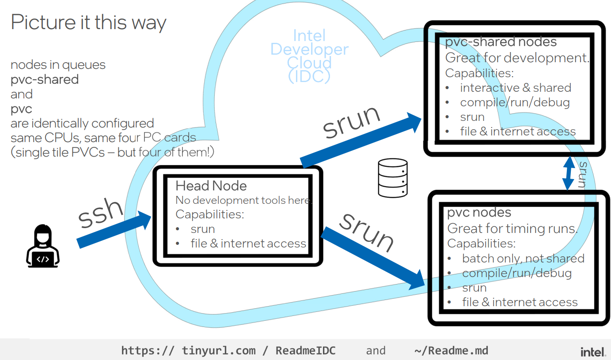
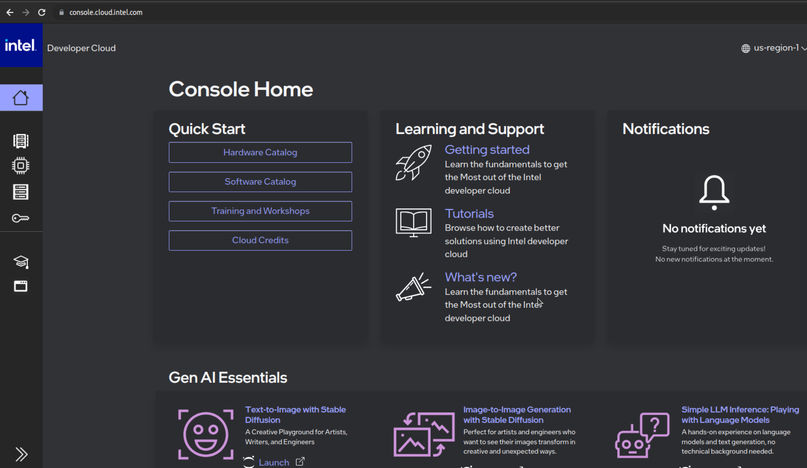
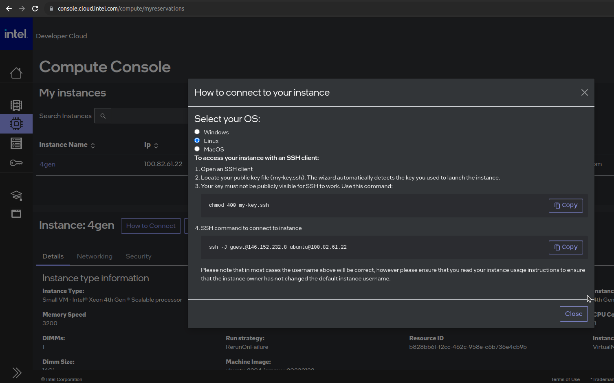

# oneAPI con IA para la escuela de invierno del CAPAP-H24

## Contenidos
* En este repositorio se encuentran los códigos propuestos en el taller....

# Setup del lab
## Repositorio 
* Puede descargarse fácilmente clonando el repositorio ejecutando en un terminal el comando ```git clone https://github.com/garsanca/capaph24```

## Transparencias
* Todo el material está disponible en el repositorio en la carpeta [Slides](Slides/)
   
   
## Cuenta en Intel Developer Cloud
* El [Intel® Developer Cloud](https://www.intel.com/content/www/us/en/developer/tools/devcloud/services.html) es un espacio de desarrollo **gratuito** para que la comunidad de desarrolladores puedan programar aplicaciones. 


### Hardware disponible
* Se puede testear y evaluar una variedad de máquinas virtuales
    * Sistemas *bare metal*
    * Dispositivos en el Edge
    * Plataformas para entrenamiento de IA
* Entornos para desarrollo
    * Contenedores
    * JupyterLabs
    * Conexión directa por SSH
    


### Instrucciones de acceso
* La documentación y actualizaciones disponible en [https://tinyurl.com/ReadmeIDC](https://tinyurl.com/ReadmeIDC) o en el [Readme.md](https://github.com/bjodom/idc)



### Registro
* Para disponer de cuenta en [Intel® Developer Cloud](https://www.intel.com/content/www/us/en/developer/tools/devcloud/services.html) se puede acceder seguir el enlace http://cloud.intel.com
* Siguiendo los pasos del proceso de registro:


1. Selección de **usuario Stardard**
2. Creación de cuenta


3. Introducción de datos personales


4. Verificación de correo mediante envío de email con un **código**

5. Aceptación de [términos y condiciones de uso](https://scheduler.cloud.intel.com/public/intel_developer_cloud_access_agreement.html) del Intel® Developer Cloud

### Acceso
* Para acceder a la cuenta en [Intel® Developer Cloud](https://www.intel.com/content/www/us/en/developer/tools/devcloud/services.html)
    * Clicar en **Already a Member? Sign In** e introducir las credenciales creadas anteriormente
* O bien se puede hacer con el "atajo" https://console.cloud.intel.com/




### Training
* JupyterLabs: en el menú **Training and Workshops**
    * Clicar en **LaunchJupyterLab**


* SSH: se puede conectar al IDC vía ssh previamente añadiendo las [*Account Keys*](https://console.cloud.intel.com/security/publickeys)


#### Configuración SSH
* Modificar el fichero *.ssh/config*

```bash
Host myidc #←YOU CAN CALL IT ANYTHING
Hostname idcbetabatch.eglb.intel.com
User uXXXXXX #← Request "scheduled access" at https://scheduler.cloud.intel.com/#/systems" to get your user identifier.
#ProxyCommand /usr/bin/nc -x YourProxy:XXXX %h %p # Uncomment if necessary
ServerAliveInterval 60
ServerAliveCountMax 10
StrictHostKeyChecking no # Frequent changes in the setup are taking place now, this will help reduce the known hosts errors.
UserKnownHostsFile=/dev/null
```

* En nodo *frontend* o *head* es un Ubuntu 22.04LTS
* Uso de nodo en modo interactivo: *srun --pty bash*
    * Nodo con Intel Data Center GPU Max 1100

``` bash 
user@localhost:~$ ssh myidc
uXXXX@idc-beta-batch-head-node:~$ srun --pty bash
uXXXX@idc-beta-batch-pvc-node-03:~$ source /opt/intel/oneapi/setvars.sh 
 
:: initializing oneAPI environment ...
   bash: BASH_VERSION = 5.1.16(1)-release
   args: Using "$@" for setvars.sh arguments: 

uXXXX@idc-beta-batch-pvc-node-03:~$ sycl-ls
Warning: ONEAPI_DEVICE_SELECTOR environment variable is set to opencl:cpu;opencl:fpga;level_zero:3.
To see the correct device id, please unset ONEAPI_DEVICE_SELECTOR.

[opencl:cpu:0] Intel(R) OpenCL, Intel(R) Xeon(R) Platinum 8480L 3.0 [2023.16.7.0.21_160000]
[opencl:acc:1] Intel(R) FPGA Emulation Platform for OpenCL(TM), Intel(R) FPGA Emulation Device 1.2 [2023.16.7.0.21_160000]
[opencl:cpu:2] Intel(R) OpenCL, Intel(R) Xeon(R) Platinum 8480L 3.0 [2023.16.7.0.21_160000]
[ext_oneapi_level_zero:gpu:0] Intel(R) Level-Zero, Intel(R) Data Center GPU Max 1100 1.3 [1.3.26516]
```

### Comandos Slurm 
* *sinfo*: obtener información de los nodos disponibles
* *squeue*: trabajos encolados
* *sbatch -p {PARTITION-NAME} {SCRIPT-NAME}*: encolar trabajo en las colas
* *scancel {JOB-ID}*: cancelar trabajo 
* *srun --pty bash*: lanzamiento de trabajo de forma interactiva

### Ejemplo lanzamiento job
1. Tomemos como ejemplo un código en SYCL que devuelve el **device** seleccionado en este caso una GPU
```c
#include <sycl/sycl.hpp>
using namespace sycl;
int main() {
//# Create a device queue with device selector
  queue q(gpu_selector_v);
//# Print the device name
  std::cout << "Device: " << q.get_device().get_info<info::device::name>() << "\n";
  return 0;
}
```

2. Podemos compilarlo con el compilador icpx
```bash
uXXXX@idc-beta-batch-pvc-node-03:~$ icpx -o ex exampleSYCL.cpp -fsycl
```

3. Lanzar job mediante slurm
```job
#!/bin/bash
#SBATCH --job-name=gpu_run
#SBATCH --partition=pvc-shared
#SBATCH --error=job.%J.err 
#SBATCH --output=job.%J.out
#SBATCH --mail-type=ALL
#SBATCH --mail-user=your@email.com

icpx -o ex exampleSYCL.cpp -fsycl
./ex
```

4. Lanzamos el job y visualizamos salida
```bash
uXXXX@idc-beta-batch-head-node:~$ sbatch job.sh
uXXXX@idc-beta-batch-head-node:~$ more job.42151.out 
Device: Intel(R) Data Center GPU Max 1100
```

### Lanzar Jupyterlab interactivo
1. Conexión por ssh al nodo *head-node*: *ssh myidc*
2. Lanzar sesión interactiva: *srun --pty bash*
3. Activar el entorno conda para poder lanzar Jupyter-Lab: *conda activate pytorch_xpu*
4. Lanzar Jupyterlab
    * Importante buscar la dirección de escucha del Jupyterlab, algo parecido a *http://10.10.10.X:8888/lab?token=9d83e1d8a0eb3ffed84fa3428aae01e592cab170a4119130*

```bash
user@localhost:~$ ssh myidc
uXXXX@idc-beta-batch-head-node:~$ srun --pty bash
uXXXX@idc-beta-batch-pvc-node-03:~$ source /opt/intel/oneapi/setvars.sh 
uXXXX@idc-beta-batch-pvc-node-03:~$ conda activate pytorch-gpu
(pytorch-gpu) uXXXX@idc-beta-batch-pvc-node-04:~$ jupyter-lab --ip $(hostname -i)
....
[I 2023-11-11 15:01:56.875 ServerApp] http://10.10.10.8:8888/lab?token=f25e4d3977b7b059d5ff4b376085562dbbaa3f9dffed4fde
....
```

5. Desde otro **terminal local** hacer un tunel ssh a la dirección que aparece en la consola lanzada: **10.10.10.X**

```bash
user@localhost:~$ ssh myidc -L 8888:10.10.10.8:8888
```

6. Conectarse con un navegador a la dirección local: **https://localhost:8888** e introducir el **token** que aparece en el ejemplo en este ejemplo *f25e4d3977b7b059d5ff4b376085562dbbaa3f9dffed4fde*

### Instancias en IDC
* Core compute
    * Basada en procesador Xeon 4th gen
       * VMs con 8, 16, 32 cores
       * Bare Metal 112 cores, 256GB y 2TB disco
* Intel Max GPU
    * 4xGPUs 1100 + 2xsockets Xeon 4th gen
* Gaudi Deep Learning Server
    * 8x Gaudi HL + Xeon Platinum 3gen
       


### Lanzar instancia
1. Lanzar instancia en la [consola->Hardware Catalog](https://console.cloud.intel.com/hardware)
2. Obtener la forma desde el apartado de [reservas](https://console.cloud.intel.com/compute/myreservations), por ejemplo mediante conexión ssh



# Ejemplos
